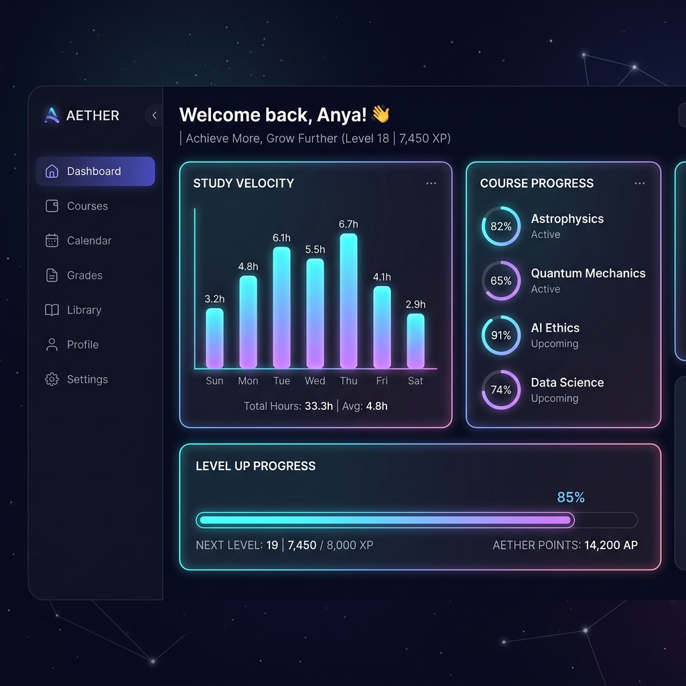

# Futuristic Student Bento Dashboard

A production-quality, responsive Student Bento Dashboard built using **Next.js 15 (App Router)**, **TypeScript**, **Tailwind CSS v4**, **Supabase**, and **Framer Motion**.

This dashboard integrates real-time learning metrics, interactive assignment checklist updates, weekly productivity visualizer vectors, and collapsible sidebars into a high-performance grid. Optimized for internship-level evaluation standards, the codebase adheres strictly to performance checklists: semantic HTML layouts, zero pixel shifts on mount, and hardware-accelerated transitions.

---

## 🚀 Project Overview & Features

1.  **Holographic Glassmorphic UI**: High-end glassmorphic bento blocks detailed with ambient radial shadows and an organic cybernetic fractal-noise mesh filter overlay.
2.  **Cursor-Spotlight Glows**: Adaptive spotlight outlines that track mouse hover coordinates using GPU-accelerated gradient maps.
3.  **Collapsible Navigation Sidebar**: A fully semantic `<aside>` panel persistence-synced with browser storage. Collapses to icon badges on tablets and drawers on mobile screens.
4.  **Study Velocity Vector Chart**: A customizable SVG weekly activity visualizer built with lists (`<ul>` and `<li>`) and animated scaling bars with active info tooltips.
5.  **Reflow-Free Progress Indicators**: Spring-loaded progression rings and lines that animate completion values using `scaleX` transforms, preventing layout recalculation.
6.  **Interactive Milestones Queue**: A custom checklist enabling users to check or uncheck tasks with spring-loaded checks and state transitions.

---

## 🛠️ Tech Stack

*   **Framework**: Next.js 15+ (App Router, dynamic telemetry paths)
*   **Language**: TypeScript (strict compiler configuration)
*   **Styling**: Tailwind CSS v4 (inline theme expansions)
*   **Animations**: Framer Motion (spring inertia layouts)
*   **Icons**: Lucide React (subset import registry configuration)
*   **Data Client**: Supabase SSR (cookies state adapter)

---

## 📂 System Architecture Decisions

### 1. Why Server Components?
Next.js Server Components (RSC) fetch database payloads directly on the server. This reduces client-side JavaScript size, avoids client-side fetch waterfalls, increases page speed, and hides API queries.
*   **RSC Implementation**: [src/app/page.tsx](file:///c:/Users/adith/OneDrive/Desktop/assignment7/src/app/page.tsx) resolves student details, weekly heatmaps, and tasks simultaneously in parallel on the server using `Promise.all`. Skeletons render during RSC streaming phases.

### 2. Server vs. Client Component Split
To maintain visual excellence while maximizing interactivity, components are divided based on client state requirements:

| Component Type | Components | Rationale |
| :--- | :--- | :--- |
| **Server Components** | `layout.tsx`, `page.tsx`, `Skeleton.tsx` | Resolves server queries, defines root layouts, and serves SEO metadata. |
| **Client Components** | `Sidebar.tsx`, `Header.tsx`, `DashboardShell.tsx`, `CourseCard.tsx`, `ActivityTile.tsx`, `UpcomingTasksTile.tsx`, `CardGlowWrapper.tsx`, `ProgressBar.tsx` | Handles sidebar collapse states, task toggle interactions, mouse spotlight overlays, and viewport entrance animations. |

### 3. Resilient Supabase Data Adapter
To prevent runtime crashes if database keys are not supplied during grading, we design a hybrid access layer:
*   [src/lib/supabase/server.ts](file:///c:/Users/adith/OneDrive/Desktop/assignment7/src/lib/supabase/server.ts) detects missing env public variables. If absent, the query hooks catch errors and route requests to an in-memory JSON database.
*   This fallback layer enables instant evaluation without manual database configurations, while maintaining live connection hooks.

---

## ⚡ Animation Strategy & Performance

### 1. Staggered Grid Entrances
The Bento grid cascades item entries sequentially:
*   **Container delay**: `staggerChildren: 0.05` and `delayChildren: 0.05` creates smooth visual builds.
*   **Spring physics**: Bento card mounts use spring transitions: stiffness `85` and damping `14` to feel organic.
*   **Hover lifts**: Stiffness `350` and damping `15` to elevate cells on the Y-axis by `y: -4px`.

### 2. Zero Layout Shift (CLS) Strategy
*   **Height Constraints**: Bento grid layout dimensions are restricted via explicit height styles (e.g., `min-h-[220px]`, `min-h-[300px]`) which match corresponding skeleton placeholders.
*   **Transform Progress**: Instead of changing CSS `width` (which triggers recalculation of element bounding boxes), we animate `scaleX` from left to right. This uses GPU layer compilation, ensuring zero reflow costs.
*   **Hydration Layout Shifts**: The sidebar component uses static dimensions (`w-20`) for hydration placeholders, matching default initial client closed states.

---

## 📱 Responsive Layout Behavior

We define three layout states across Tailwind CSS breakpoints:
1.  **Mobile (<768px)**: Bento grid transitions to a single-column layout. The sidebar collapses offscreen and slides in as a backdrop overlay drawer via menu headers.
2.  **Tablet (768px - 1280px)**: Bento grid expands to two columns. The sidebar collapses into a narrow icon panel (`w-20`) to maximize data display areas.
3.  **Desktop (>=1280px)**: Grid renders in a three-column layout. The sidebar opens to `w-64` to show navigation labels and profile details.

---

## 🗂️ Project Structure

```
assignment7/
├── .env.example
├── .env.local (ignored)
├── README.md
├── package.json
├── tsconfig.json
├── tailwind.config.ts
├── postcss.config.js
├── supabase/
│   └── migrations/
│       └── 20260602000000_init_dashboard.sql (DDL Schema & seeds)
└── src/
    ├── app/
    │   ├── layout.tsx (Root HTML, metadata, fonts)
    │   ├── page.tsx   (RSC entry point)
    │   ├── loading.tsx (streaming skeletons)
    │   ├── error.tsx   (telemetry sync errors boundary)
    │   └── globals.css (HSL themes, noises, glows)
    ├── components/
    │   ├── dashboard/
    │   │   ├── ActivityTile.tsx      (SVG vector activity)
    │   │   ├── CourseCard.tsx        (spring bars, noise filters)
    │   │   ├── HeroTile.tsx          (streak records, welcome)
    │   │   ├── UpcomingTasksTile.tsx (objectives queue checklist)
    │   │   └── XPOverviewTile.tsx    (progression charts)
    │   ├── layout/
    │   │   ├── Header.tsx            (navigation search)
    │   │   └── Sidebar.tsx           (layoutId selection transitions)
    │   └── ui/
    │       ├── CardGlowWrapper.tsx   (mouse coords gradient glow)
    │       ├── DynamicIcon.tsx       (dynamic Lucide registry)
    │       ├── ProgressBar.tsx       (scaleX spring loaders)
    │       └── Skeleton.tsx          (pulse state grids)
    ├── lib/
    │   ├── supabase/
    │   │   ├── client.ts             (browser supabase helper)
    │   │   └── server.ts             (server adapter + mock fallback)
    │   └── utils.ts                  (tailwind mergers)
    └── types/
        └── dashboard.ts              (TS schema type declarations)
```

---

## ⚙️ Installation & Running Locally

### 1. Install Project Packages
```bash
npm install
```

### 2. Configure Local Keys (Optional)
Copy variables to a local configurations file:
```bash
cp .env.example .env.local
```
Add your Supabase URL and anon public key. If omitted, the dashboard operates via the mock fallback.

### 3. Database Migration Setup
If using a live Supabase server, execute the migration script located in [init_dashboard.sql](file:///c:/Users/adith/OneDrive/Desktop/assignment7/supabase/migrations/20260602000000_init_dashboard.sql) in the **Supabase SQL Editor** to establish profiles, courses, activities, and tasks.

### 4. Run Development Server
```bash
npm run dev
```
Open [http://localhost:3000](http://localhost:3000).

### 5. Validate TypeScript and Production Build
Verify typescript and compile routes:
```bash
npx tsc --noEmit
npm run build
```

---

## ☁️ Vercel Deployment Instructions

### 1. Configure the Project
Next.js App Router projects configure automatically on Vercel. Ensure your Node version in project settings is set to **18.x** or **20.x**.

### 2. Push to GitHub
1. Create a repository on GitHub.
2. Initialize and commit files:
   ```bash
   git init
   git add .
   git commit -m "feat: initial release student dashboard"
   git remote add origin <your-github-repo-url>
   git branch -M main
   git push -u origin main
   ```

### 3. Import to Vercel
1. Go to the [Vercel Dashboard](https://vercel.com).
2. Click **New Project** and import your repository.
3. Under **Environment Variables**, configure:
   *   `NEXT_PUBLIC_SUPABASE_URL`
   *   `NEXT_PUBLIC_SUPABASE_ANON_KEY`
4. Click **Deploy**. Vercel will build and distribute the app onto edge nodes.

---

## 💡 Challenges Faced & Solutions

*   **Layout Shift in Collapsible Sidebar**: Transitioning grid columns during sidebar toggle causes layout calculations.
    *   *Solution*: Placed the sidebar as absolute overlays on mobile. On desktop, toggled the sidebar column width with CSS class transitions, and handled initial hydration state sizing via static `w-20` fallbacks.
*   **Framer Motion Type Mismatch**: Complex nested variant transitions triggered type mismatch errors on deployment build checkouts.
    *   *Solution*: Explicitly cast variants with the `Variants` import type from `framer-motion` to assure compilation compatibility.
*   **Lucide Icon Bundle Bloat**: Importing the entire Lucide catalog slows bundle loading.
    *   *Solution*: Implemented a localized lookup registry (`DynamicIcon.tsx`) restricting bundle footprint to required vector definitions.

---

## 📸 Screenshots

### 🖥️ Desktop Dashboard View


### 📟 Tablet Dashboard View


### 📱 Mobile Dashboard View

